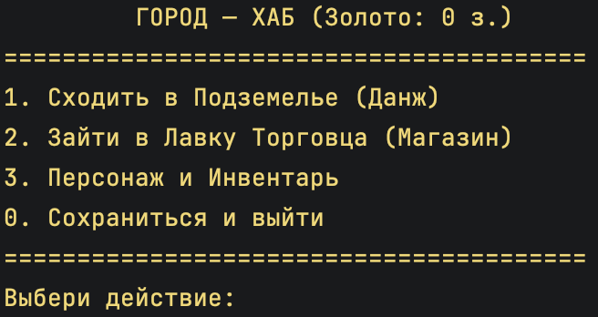

# 🗡️ Console RPG Engine

Текстовая консольная RPG-игра на C# (.NET 8), разработанная с использованием фундаментальных принципов ООП, паттернов проектирования и полиморфной JSON-сериализации.


  -->

## 🎮 Основные возможности

* **Игровой цикл (State Machine):** Бесшовный переход между Хабом (городом), Подземельем (данжем) и Магазином.
* **Система Сохранений (Persistence):** Сохранение и загрузка полного прогресса героя (характеристики, золото, уровень, экипировка и инвентарь) в JSON-файл.
* **Пошаговая Боевая система:** Сражения с процедурно генерируемыми врагами, расчет урона с учетом защиты брони и критических ударов, механика уклонения и легендарные сундуки с лутом.
* **Экономика и Торговля:** Покупка и продажа предметов, динамическое обновление ассортимента магазина.
* **Инвентарь и Экипировка:** Разделение предметов по слотам (оружие, слоты брони, зелья лечения) и применение предметов прямо во время боя.

## 🛠 Архитектура, ООП и Технологии

* **Наследование и Полиморфизм:** Базовый абстрактный класс `Item` с наследуемыми типами `Weapon`, `Armor` и `HealthPotion`.
* **Полиморфная JSON-сериализация:** Использование атрибутов `[JsonPolymorphic]` и `[JsonDerivedType]` (`System.Text.Json`) для сохранения точных типов объектов при сериализации в файл.
* **Паттерн Фабрика (`Factory`):** Использование `EnemyFactory` для изолированной генерации врагов.
* **Работа с Файловой системой:** Модуль `SaveSystem` с детерминированной проверкой наличия файлов на диске.
* **Композиция:** Управление экипировкой через `Dictionary<ArmorType, Armor>` и инвентарем через динамические списки.

## 🚀 Как запустить

1. Клонируйте репозиторий:
   ```bash
   git clone [https://github.com/zelid-byte/RpgEngine.git](https://github.com/zelid-byte/RpgEngine.git)
